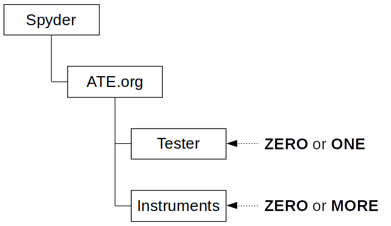

# ATE.org

`ATE.org` is a tester/instrument <ins>agnostic</ins> framework for ATE ASIC testing projects.

`ATE.org` support the following 'electronic grades':

| Grade        | Standards           | Temp range |
| ------------- |:-------------:| -----:|
| [Consumer](https://en.wikipedia.org/wiki/Consumer_electronics)       | [CEA](https://ihsmarkit.com/products/cea-standards.html) | 0..70 °C |
| [Industrial](http://www.industrial101.com/electronics/)     |       | −40..85 °C|
| [Automotive](https://en.wikipedia.org/wiki/Automotive_electronics) | [AEC](http://www.aecouncil.com/AECDocuments.html)      | −40..150 °C |
| [Medical](https://en.wikipedia.org/wiki/Medical_device)| [IEC](https://www.tuvsud.com/en/industries/healthcare-and-medical-devices/medical-devices-and-ivd/medical-device-testing/physical-testing-of-medical-devices/iec-60601-1) | 0..85 °C|
| [Military](https://www.quora.com/What-is-the-difference-between-consumer-grade-transistors-and-military-grade-ones) | [MIL](https://en.wikipedia.org/wiki/United_States_Military_Standard)| -55..125 °C|

Notes: 
 1. The temperature ranges are case/manufacturer dependent and might change.
 2. Additional standards might apply based on use-case.

It also has **full** support for `sensor` [testing](https://www.basicairdata.eu/introduction-to-sensor-testing/) !

It is implemented as a set of libraries **AND** a plug-in system to the [Spyder](https://github.com/spyder-ide/spyder)-IDE (starting from V5).

It adds the **ATE project type** to Spyder, with which one can organize ATE tests, test-programs, test-flows ... in a structured -and equipment agnostic- way.

The `equipment` is brought in by means of plug-ins to ATE.org itself.

# Description

`ATE.org` is a tester/instrument **agnostic** framework. This means that the system is **not** build around a
a specific instrument (let's consider an ATE tester for a moment as a super instrument😋), it rather focuses on 
organizing semiconductor testing (hence the project name: ATE.org) in such a way that all special corner cases have
their well known place. This enables the users to focus on the **REAL** work : <ins>writing test</ins>. The `automotive` semiconductor `sensor` industry probably has the toughest demands when it comes to use- and corner-cases. That's why
`ATE.org` is set up to fully support this industry. There thus will be few use- and corner-cases not covered initially, and 
of course we will give also those a place `ATE.org`!

... give me more ...

# Note

This project has been set up using PyScaffold 3.2.2. For details and usage
information on PyScaffold see https://pyscaffold.org/.
