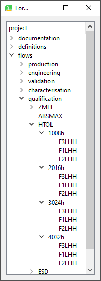

# actions_on\flow\HTOL

Context menu :

 
 
Then the Wizard to make a new HTOL 'group' should open:

 
 

Note that :

1. A `HTOL group` must have also a `Reference` (above the reference is the Zero Hour Measurements)

    The list in the comboBox is 'ZMH' and all other 'HTOL-groups' that currently exist.
2. A `HTOL group` must have a Temperature
3. Minimum duration is 1 hour, maximum is 8760 (=1year!)
4. Validation window is minimum 12 hours, and maximum 168 hours (=7days !!!)
5. Minimum VDD is 1.8V, maximum 72V
6. Minimum Temperature is 40°C, and maximum is 200°C

With the above wizard we will get the '1008h' `HTOL-group`, and on a group one can use the Edit context menu

 
 
doing so will launch the `HTOL Group Editor` that looks as follows:

 

Here we can edit the **ORDER** in which the test programs in the HTOL-group
are to be executed.

Note: 

1. It depends on the `Reference` if movement is possible at all, but even if it is not, we have a nice overview of the HTOL-Group. (above we see that the vDD of `4032h` is wrong)

2. Maybe there should also be an `export` button to export this table to an XLSX file ?!? (for later)

---

The HTOL Tree View for the XLSX example of HATC would look like this:

 

Notes:

1. It would be interesting if a 'multi-line-tooltip' would work, as we could present the information on a `HTOL-group` in the tooltip :heart_eyes:

2. In the above picture, the 'test programs' are denoted as the `user_text`, this is interesting, but the format should be more like 
`BLAHBLAHBLA (F3LHH)` where 'BLAHBLAHBLA' is the real program name (given by ATE.org!), and the `user_text` in the program would be `F3LHH`
'BLAHBLAHBLA' would probably (needs defining) resolve to something like `HATC_XXX_Q_HTOL_1008h_1` where 'XXX' would be the `Target` :yum:

---

# Please use .ui files as base of a wizard, doing this by hand is too time-consuming !!!