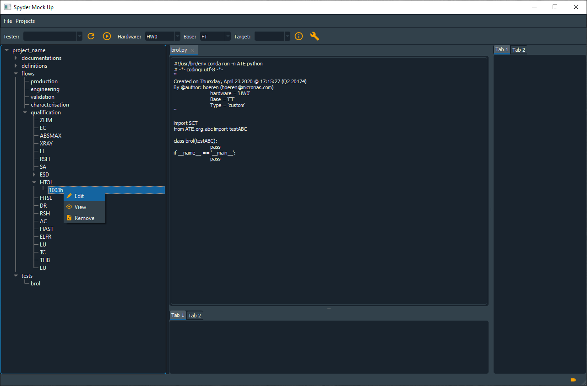

# actions_on\flow\HTOL

Context menu :

 
 
Then the Wizard to make a new HTOL 'group' should open:

 
 

Note that :

1. A `HTOL group` must have also a `Reference` (above the reference is the Zero Hour Measurements)
2. A `HTOL group` must have a Temperature
3. Minimum duration is 1 hour, maximum is 8760 (=1year!)
4. Validation window is minimum 12 hours, and maximum 168 hours (=7days !!!)
5. Minimum VDD is 1.8V, maximum 48V
6. Minimum Temperature is 40°C, and maximum is 200°C

Then we get the '1008h' HTOL group, and on a group one can use the Edit context menu

 
 
doing so will launch the `HTOL Group Editor` that looks as follows:

 

Here we can edit the **ORDER** in which the test programs in the HTOL-group
are to be executed.

Note: 

1. It depends on the `Reference` if movement is possible at all, but even if it is not, we have a nice overview of the HTOL-Group.

2. Maybe there should also be an `export` button to export this table to an XLSX file ?!? (for later)

---

# Please use .ui files as base of a wizard, doing this by hand is too time-consuming !!!